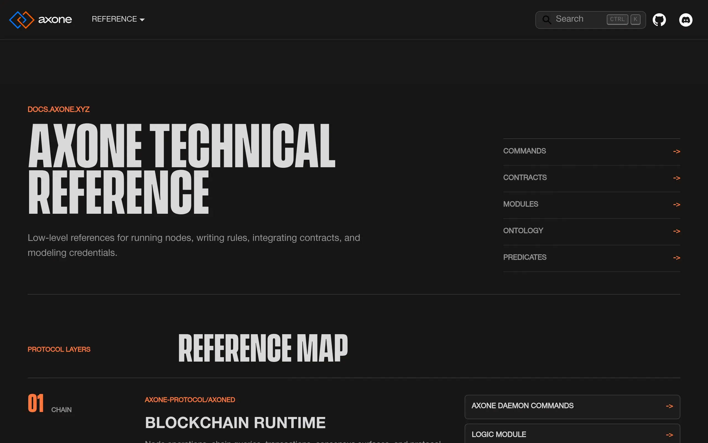

# Axone technical reference

> Versioned technical reference for the Axone protocol, powered with ❤️ by [Docusaurus](https://docusaurus.io/).

[](https://github.com/axone-protocol/docs/actions/workflows/lint.yml)
[](https://github.com/axone-protocol/docs/actions/workflows/build.yml)
[](https://docs.axone.xyz/)
[![license][bsd-3-clause-image]][bsd-3-clause]
[![cc-by-sa-4.0][cc-by-sa-image]][cc-by-sa]

## Overview

This repository hosts <https://docs.axone.xyz>. It is scoped to deep technical reference material that is versioned with, and synchronized from, Axone implementation repositories.

[](https://docs.axone.xyz)

The Docusaurus site exposes five technical sections:

- [`commands`](./commands), [`modules`](./modules), and [`predicates`](./predicates), sourced from [`axone-protocol/axoned`](https://github.com/axone-protocol/axoned)
- [`contracts`](./contracts), sourced from [`axone-protocol/contracts`](https://github.com/axone-protocol/contracts)
- [`ontology`](./ontology), sourced from [`axone-protocol/ontology`](https://github.com/axone-protocol/ontology)

Editorial, onboarding, tutorial, FAQ, and whitepaper content are intentionally out of scope for this repository.

## Development

Install dependencies:

```sh
yarn
```

Start the local development server:

```sh
yarn start
```

Build the static site:

```sh
yarn build
```

Run local checks:

```sh
yarn lint
```

The local search index is generated during production builds. To test search locally, run `yarn build` and then `yarn serve`.

## Synchronization

External references are configured in [`.github/sync-external-docs-sources.json`](./.github/sync-external-docs-sources.json) and synchronized by [`.github/scripts/sync-external-docs.mjs`](./.github/scripts/sync-external-docs.mjs).

Dry-run synchronization:

```sh
yarn sync:external-docs:dry-run
```

Do not hand-edit synchronized reference content or versioned snapshots.

## License

The Docusaurus site code is [3-Clause BSD][bsd-3-clause] licensed.

Documentation content is licensed under [Creative Commons Attribution-ShareAlike 4.0 International][cc-by-sa] where applicable, unless an upstream source states otherwise.

[bsd-3-clause]: https://opensource.org/licenses/BSD-3-Clause
[bsd-3-clause-image]: https://img.shields.io/badge/License-BSD_3--Clause-blue.svg?style=for-the-badge
[cc-by-sa]: https://creativecommons.org/licenses/by-sa/4.0/
[cc-by-sa-image]: https://i.creativecommons.org/l/by-sa/4.0/88x31.png
