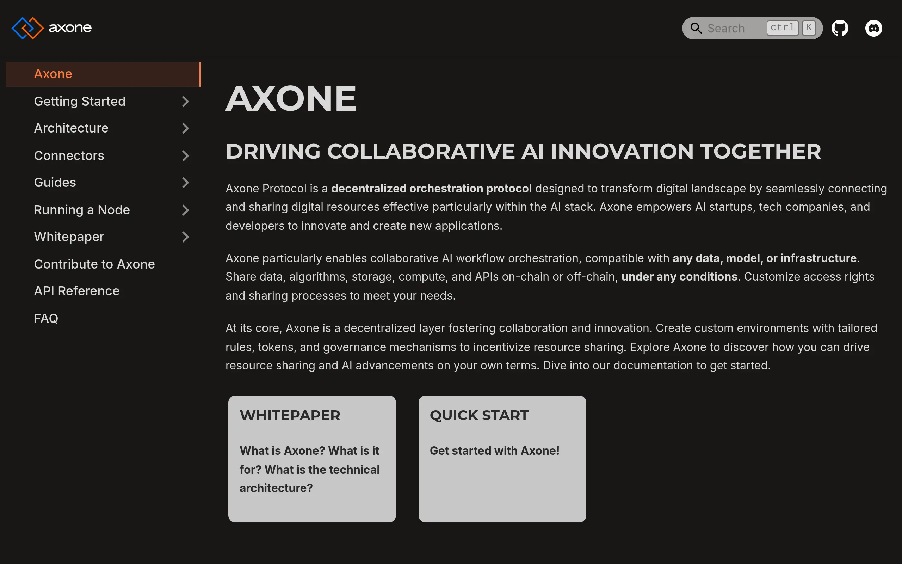

# Axone documentation

> Axone documentation repository, powered with ❤️ by [Docusaurus](https://docusaurus.io/), a modern static website generator.

[](https://github.com/axone-protocol/docs/actions/workflows/lint.yml)
[](https://github.com/axone-protocol/docs/actions/workflows/build.yml)
[](https://github.com/axone-protocol/docs/actions/workflows/publish.yml)
[](https://conventionalcommits.org)
[](https://github.com/axone-protocol/.github/blob/main/CODE_OF_CONDUCT.md)
[](https://github.com/prettier/prettier)
[![license][bsd-3-clause-image]][bsd-3-clause]
[![cc-by-sa-4.0][cc-by-sa-image]][cc-by-sa]

## Overview

This repository contains the source code for the AXONE documentation portal, which is hosted at <https://docs.axone.xyz>.

[](https://docs.axone.xyz)

## Developing & contributing

### Installation

```sh
yarn
```

### Local Development

```sh
yarn start
```

This command starts a local development server and opens up a browser window (<http://localhost:3000/>). Most changes are reflected live without having to restart the server.

Note that the search won't work in development. To use the search feature, first run `yarn build` then `yarn run serve`.

### Build

```sh
yarn build
```

This command generates static content into the `build` directory and can be served using any static contents hosting service.

## Code Quality

The coding style rules are enforced by the following tools:

- [Commitlint](https://commitlint.js.org/#/)
- [Markdownlint](https://github.com/igorshubovych/markdownlint-cli)
- [Prettier](https://prettier.io/)
- [Stylelint](https://stylelint.io/)

## License

The AXONE documentation portal is open source and [3-Clause BSD][bsd-3-clause] licensed.

The contents of the documentation (e.g. the `.md` files in the `/docs` folder) is [Creative Commons Attribution-ShareAlike 4.0 International][cc-by-sa] licensed.

[bsd-3-clause]: https://opensource.org/licenses/BSD-3-Clause
[bsd-3-clause-image]: https://img.shields.io/badge/License-BSD_3--Clause-blue.svg?style=for-the-badge
[cc-by-sa]: https://creativecommons.org/licenses/by-sa/4.0/
[cc-by-sa-image]: https://i.creativecommons.org/l/by-sa/4.0/88x31.png

## You want to get involved? 😍

So you want to contribute? Great! ❤️ We appreciate any help you're willing to give. Don't hesitate to open issues and/or
submit pull requests.

We believe that collaboration is key to the success of the AXONE project. Join our Community discussions on the [Community Repository](https://github.com/axone-protocol/community) to:

- Engage in conversations with peers and experts.
- Share your insights and experiences with AXONE.
- Learn from others and expand your knowledge of the protocol.

The Community Repository serves as a hub for discussions, questions, and knowledge-sharing related to AXONE. We encourage you to actively participate and contribute to the growth of our community.

Please check out AXONE health files:

- [Contributing](https://github.com/axone-protocol/.github/blob/main/CONTRIBUTING.md)
- [Code of conduct](https://github.com/axone-protocol/.github/blob/main/CODE_OF_CONDUCT.md)
