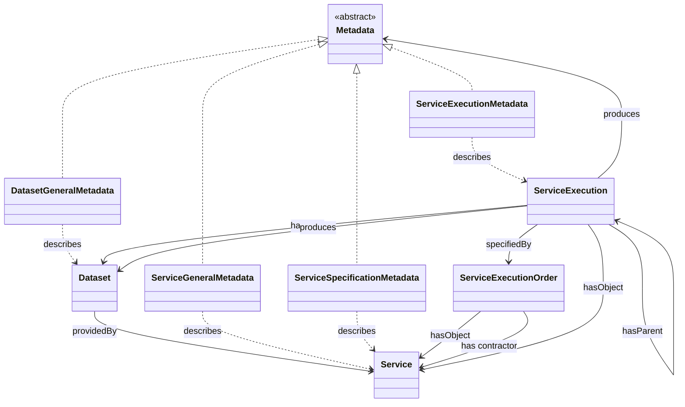

# Axone Ontology

The Axone protocol orchestrates the various resources of the Dataverse (datasets and services) using different blockchain elements such as smart contracts, logic modules, and ontology. All these elements allow for fine management of dataset and service workflows for knowledge creation within a zone with personalized governance. As seen previous sections, the ontology must stand for the different concepts of the protocol, their relationships, and their properties.

## The big picture

The following diagram depicts the introduced concepts and their relationship with the already existing concepts of the ontology.

## Class and properties

The following concepts and properties are found within the Axone ontology:

### Data

This refers to the data contained within a dataset.

### Dataset

- hasIdentifier

This is a dataset made available by a user on the protocol.

### DatasetGeneralMetadata

- hasTag
- hasCreator
- hasDescription
- hasPublisher
- hasTitle
- hasSpatialCoverage
- hasTemporalCoverage
- hasImage

This is the description of a given dataset in metadata form.

### Zone

Zone is a conceptual framework that is established based on a set of rules, within which recognized `Resources` must conform, considering associated consents.

Zones are described by a set of metadata providing information about various aspects of the zone, such as the zone's name, general information about the provider, and more.

Specific data description vocabularies and thesauri are used to structure this metadata. A dedicated metadata profile outlines the rules that govern the zone, expressing its fundamental principles, intentions, scope, and ultimate objectives. These rules encompass the entities involved and the Resources that interact within the zone.

They can be customized to address specific use cases, industry sectors, partnership networks, or geographic regions, facilitating tailored governance arrangements within a specific context.

### DIDURI

A decentralized identifier URI. A URI that identifies a subject in a decentralized system and is managed independently of any centralized registry.

### Metadata

The information data about something (i.e. data about the data). This something can be a zone, a Dataset, a Service, or any other entity that can be described.

Metadata is an abstract concept which is refined in Metadata Profiles used to provide a formal specification that defines the set of metadata elements, their semantics, and their syntax to be used in a particular context or application. The Axone protocol proposes several profiles at the core of the ontology, such as GeneralMetadata for describing services or datasets.

### Resource

Services or datasets, a resource belongs to the Dataverse.

### Service

- hasIdentifier
  A service consumes a resource and produces data.

## Conclusion

With all these concepts, their properties, and their relationships, we can create the Axone ontology and explain the workings of the Axone protocol in a structured and formalized way. This ontology can be expressed in different formats, both understandable by humans and machines. It can be expressed in French or English, RDF, OWL, JSON-LD, N-Triples, Notation3 RDF/XML, Turtle, etc.
