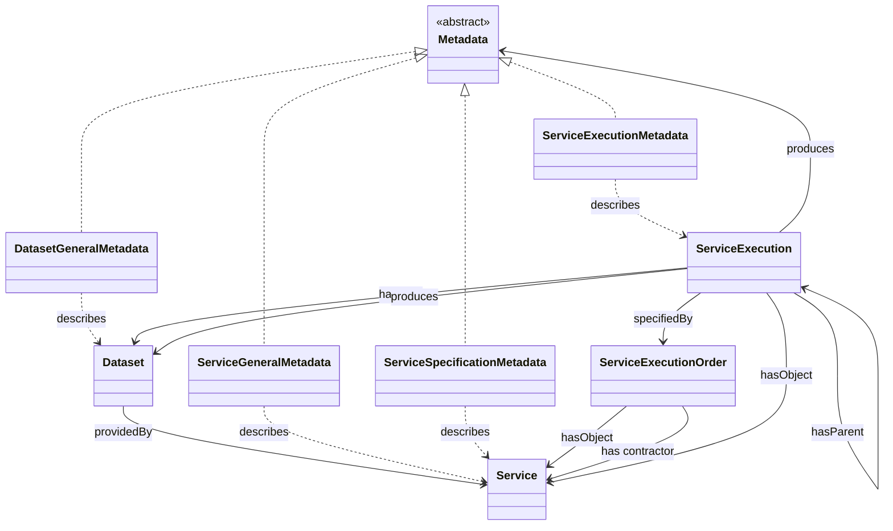

# OKP4 Ontology principles 

## What is an ontology ? 

In computer science, ontology is a formal and structured representation of the concepts, relationships, and properties of a particular domain. An ontology generally comprises the following basic elements: concepts, relationships, properties, axioms, and instances. These can be graphically represented by the simplified equation shown below.


Some definitions:
- Concepts: represent entities in the knowledge domain to be shared.
- Relationships: represent links between concepts.
- Properties: associated with concepts.
- Axioms: logical rules that define relationships between concepts and properties.
- Instances: specific examples of concepts.
- Individuals: concrete instances of classes representing objects in the application domain. In OKP4, individuals are used to represent real-world datasets and services.

Some examples of ontology:

An ontology of African wildlife : 


An ontology of geographical concepts : 


## Why ontologies ? 

For OKP4, ontology is essential as it enables the description of shared knowledge. Participants can better understand and interpret the exchanged information, even if they come from different backgrounds.

This ontology allows us to achieve:
- Standardization of terminology: standardized terminology is used for concepts and relationships in a given domain, clarifying and avoiding misunderstandings between participants.
- Structuring of data: data is structured in a coherent and organized way, making it easier to access, process, and analyze.
- Interoperability of systems and tools: a well-designed ontology enables interoperability between systems and tools, facilitating the sharing of knowledge among different stakeholders.
- Improved data research and analysis by accurately describing concepts and relationships in a particular domain.

The knowledge representation language chosen for OKP4 is [RDF Schema](http://www.w3.org/TR/rdf-schema/) and [Web Ontology Language](http://www.w3.org/TR/owl2-overview/) on top of the framework [Resource Description Framework](http://www.w3.org/TR/rdf-concepts/).


### A formal model for the OKP4 blockchain

This ontology describes and defines the different forms of vocabularies used in the [OKP4](https://okp4.space) protocol in a standard and well designed format. The aim is to model a semantic network of all the _entities_  (Data Spaces, data, services, processing workflows) by semantically characterizing what they are and the relationships they maintain between them. Thus, the ontology provides a complete living understanding and knowledge of the datasets within a Data Space, their transformation (by the services), as well as the governance rules that apply (data sharing, consents, policy rules).

### Ontology at the heart of the blockchain

Ontology is at the heart of the [OKP4](https://github.com/okp4/okp4d) protocol as much of the information is encoded and stored as an ontology _on-chain_ in the blockchain transactions. This means that (almost) all the semantics of the transactions submitted to the blockchain are expressed through this ontology - for instance the creation of a dataspace, the execution of a service, the description of a dataset, etc.


## The OKP4 ontology

The OKP4 protocol orchestrates the various resources of the Dataverse (datasets and services) using different blockchain elements such as smart contracts, logic modules, and ontology. All these elements allow for fine management of dataset and service workflows for knowledge creation within a Data Space with personalized governance. As seen previously, the ontology must stand for the different concepts of the protocol, their relationships, and their properties. 

The following diagram depicts the introduced concepts and their relationship with the already existing concepts of the ontology.



### Class and properties

The following concepts and properties are found within the OKP4 ontology: 

#### Data

 This refers to the data contained within a dataset. 

#### Dataset 

- hasIdentifier 

This is a dataset made available by a user on the protocol.

#### DatasetGeneralMetadata 
- hasTag 
- hasCreator 
- hasDescription 
- hasPublisher 
- hasTitle 
- hasSpatialCoverage 
- hasTemporalCoverage 
- hasImage 

This is the description of a given dataset in metadata form.

#### Data Space 

A Data Space groups resources.

#### DIDURI 

A decentralized identifier URI. A URI that identifies a subject in a decentralized system and is managed independently of any centralized registry.

#### Metadata 

The information data about something (i.e. data about the data). This something can be a Dataset, a Service, a Dataspace, or any other entity that can be described.
Metadata is an abstract concept which is refined in Metadata Profiles used to provide a formal specification that defines the set of metadata elements, their semantics, and their syntax to be used in a particular context or application. The OKP4 protocol proposes several profiles at the core of the ontology, such as GeneralMetadata for describing services or datasets.

#### Resource 
Services or datasets, a resource belongs to a Data Space.

#### Service 
- hasIdentifier 
A service consumes a resource and produces data.


This ontology in OWL language is written as follows: 


```
Class: example:Data
Annotations:
rdfs:label "Data"
rdfs:comment "Define a data"
Class: example:Dataset
Annotations:
rdfs:label "Dataset"
rdfs:comment "Define a data"
SubClassOf: owl:Thing
ObjectProperty: example:hasIdentifier
Characteristics: owl:FunctionalProperty
Domain: example:Dataset
Range: xsd:string
ObjectProperty: example:providedBy
Characteristics: owl:ObjectProperty
Domain: example:Dataset
Range: example:Service
ObjectProperty: example:hasRegistrar
Characteristics: owl:ObjectProperty
Domain: example:Dataset
Range: example:DIDURI

Class: example:DatasetGeneralMetadata
Annotations:
rdfs:label "Dataset General Metadata"
rdfs:comment "Define a data"  
```

With all these concepts, their properties, and their relationships, we can create the OKP4 ontology and explain the workings of the OKP4 protocol in a structured and formalized way. This ontology can be expressed in different formats, more or less understandable by humans or machines. It can be expressed in French or English, RDF, OWL, JSON-LD, N-Triples, Notation3 RDF/XML, Turtle, etc.


## Documentation

Last released version of OKP4 ontology documentation is available here: <https://ontology.okp4.space>.

## Some assumptions

- There's no one correct way to model a domain and a trade-off must be found between the meaning given to ontology, its expressiveness, its extensibility and its usage.
- The OKP4 ontology is not frozen. It is built step by step in an iterative process (see next section), and some decisions made here may be changed later.
- It should be understood that OWL modeling is different from UML modeling (or more simply of the Oriented Object interpretation that one would be tempted to make). As such, the following readings are relevant:
  - [A detailed comparison of UML and OWL](https://madoc.bib.uni-mannheim.de/1898/1/TR2008_004.pdf)
  - [A common misconception regarding owl properties](https://henrietteharmse.com/2018/06/22/a-common-misconception-regarding-owl-properties/)
- OWL being a logical description language, some deductions can be made by an OWL reasoner. However, as far as possible, it will be best to make explicit what could be deduced by an OWL reasoner.
