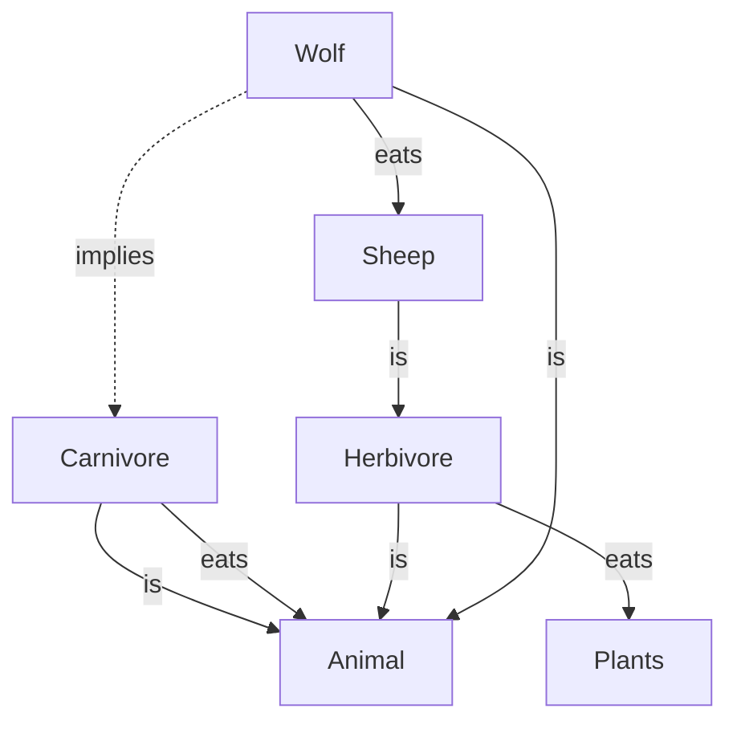
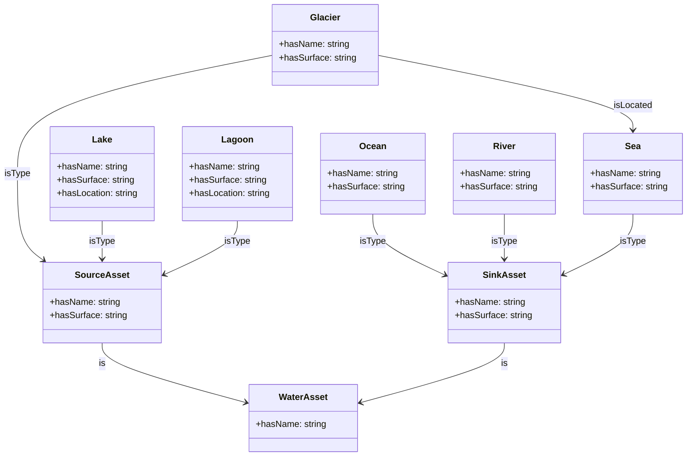

# What are ontologies ?

## Definition

In computer science, ontology is a formal and structured representation of the concepts, relationships, and properties of a particular domain. An ontology generally comprises the following basic elements: concepts, relationships, properties, axioms, and instances. These can be graphically represented by the simplified equation shown below.

  </img>

Some definitions:

- **Concepts**: represent the main formalized elements of the domain.
- **Relationships**: represent links between concepts.
- **Properties**: represent specific attributes or characteristics of the concepts themselves.
- **Axioms**: represent logical statements or rules that define relationships between concepts, properties, and instances, ensuring the consistency and coherence of the knowledge represented within the ontology..
- **Instances**: the concrete instances of concepts representing objects in the application domain. In OKP4, instances are used to represent all the resources of the dataverse.

## Examples

### Sheep and goat

source: OKP4

### Water resources

source: Axone from SAREF extension for water

## Ontology construction process

The construction of this ontology follows a number of steps which are described below:

- **Ontology scope definition (1) & knowledge acquisition (2)**: Identification and definition of key concepts and relationships in the domain of interest and the terms that refer to such concepts, in natural language.
- **Ontology specification (3) & conceptualization (4)**: Formalizing of the elements identified in the previous step in the form of a knowledge representation, using the building blocks of ontologies: classes, attributes, relationships, subsumption.
- **Ontology implementation (5)**: Encoding the ontology according to the OWL grammar.
- **Ontology evaluation (6)**: Association of key concepts and terms in the ontology with concepts and terms of other ontologies.

  </img>

## Underlying Assumptions

- Modeling a domain is not a one-size-fits-all process. There's a balance to be struck between the ontology's meaning, its expressivity, its potential for expansion, and its actual application.
- The development of the Axone ontology is dynamic. It evolves progressively through an iterative process (detailed in the subsequent section). Some decisions taken now may be revisited in the future.
- It's crucial to recognize the distinction between OWL modeling and [UML](https://en.wikipedia.org/wiki/Unified_Modeling_Language) modeling. The latter, often rooted in Object-Oriented interpretations, varies from OWL's approach. For deeper insights, the following resources are recommended:
  - [Comparing UML and OWL in Depth](https://madoc.bib.uni-mannheim.de/1898/1/TR2008_004.pdf)
  - [Dispelling a Common Myth about OWL Properties](https://henrietteharmse.com/2018/06/22/a-common-misconception-regarding-owl-properties/)
- Given that OWL operates as a logical description language, certain inferences can be drawn using an OWL reasoner. Nevertheless, wherever feasible, it's preferable to clarify aspects that could otherwise be left for an OWL reasoner to deduce.
