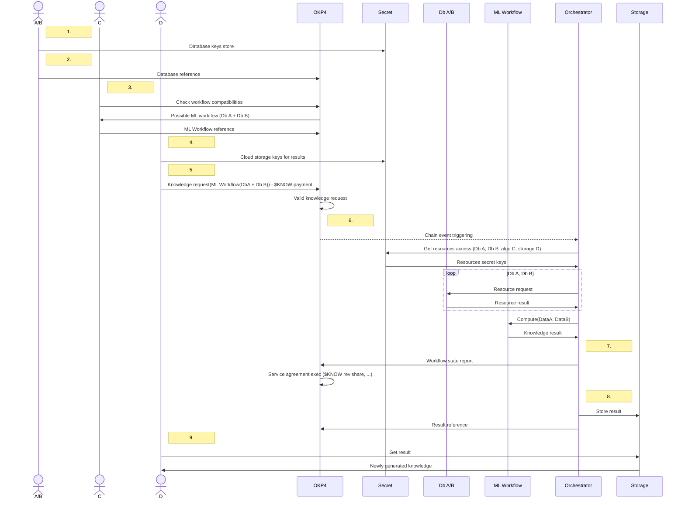

# Architecture

## General overview

The protocol provides a disruptive access control mechanism. Whereas a central gateway usually safekeeps a specific set of resources, OKP4 protocol acts as a global source of trust for any operation:

In a user interface, providers indicate the rules for consuming their resources. The interface interacts with the blockchain, which stores the resources descriptions, revenue conditions, restrictions and execution instructions.
A consumer asks the blockchain through an app to execute a request using multiple resources. If the rules set by the providers are met, the protocol emits an event to validate the request.
An orchestration service, the guard on a resource relying solely on blockchain validation events, processes the request from the consumer. This request creates new knowledge as it leverages multiple resources from different providers with no required trust on a third party.
The orchestration service reports the execution status to the blockchain to ensure reliable logging and payment.

Smart contracts carry all these interactions with the blockchain. Nodes validate smart contracts execution and persistent storage through a consensus. A distributed database, the so-called blockchain, commits to every change. The OKP4 blockchain is built with custom modules enabling the protocol governance and validation rules capabilities, among other functionalities.

The diagram above provides a simplified explanation of the system’s overall operation. More precisely, the entire solution architecture is structured as follows:

## Blockchain

### Distributed network

Multiple nodes execute and validate all actions submitted to the blockchain thanks to the Tendermint consensus.
Tendermint is a partially synchronous Byzantine fault-tolerant (BFT) consensus protocol. The protocol requires a fixed, known set of validators, where their public key identifies each validator. Validators attempt to reach a consensus on one block at a time, where a block is a list of transactions. Voting for consensus on a block proceeds in rounds. Each round has a round leader, or proposer, who proposes a block. The validators then vote, in stages, on whether to accept the proposed block or move on to the next round. The proposer for a round is chosen deterministically from the ordered list of validators in proportion to their voting power. Tendermint's security is derived from optimal Byzantine fault tolerance through super-majority voting and a locking mechanism.

### Shared state

When a user wants to update the blockchain state, he submits a transaction with cryptographic keys authentication. Users interacting with the network pay fees to these validators for every transaction. These fees are paid with the OKP4 blockchain native coin, $KNOW.

Validators guarantee the reliability of the blockchain. As they all share the same on-chain data and process the same transactions, if a node acts maliciously (e.g., the purpose of updating a state for its benefit without required permissions), the rest of the network will reject it. The economic incentive with $KNOW fees makes virtuous behavior more profitable than unwise conduct.  

### Built on Cosmos

The OKP4 blockchain is built with the Cosmos SDK to benefit from advanced implementation options without reinventing the wheel. Cosmos's modular architecture enables customized application-specific chains with ease. This unique flexibility fits the project's requirements, ensuring optimal performance and resource allocation.

Moreover, with Cosmos's Inter-Blockchain Communication (IBC) protocol, the OKP4 blockchain can communicate and transact seamlessly with other chains within the Cosmos ecosystem and external networks. This interchain compatibility expands the reach and potential user base and opens avenues for collaboration and synergy with other innovative projects in the Cosmos ecosystem and beyond.

## Modules

The modules implement core functions particular to the OKP4 blockchain. They provide features for protocol governance, rules interpretation regarding resources, and more.

### Logic

The `logic` module is designed to primarily address logical queries based on facts sourced from the ontology or the state of the chain, along with inference rules. It's main use in the protocol is the management of governance rules, written in Prolog. Thus, any smart contract deployed on the OKP4 blockchain can use the logic module to evaluate queries written in Prolog. 

Prolog is a powerful declarative programming language to manage from simple restrictions to complex rules. This language is not natively operable on-chain; the logic module adds Prolog interpretation capability.
The `logic` module is not strongly coupled to the OKP4 blockchain. It’s designed to be reusable and can be integrated with any Cosmos appchain. Because it’s open and interoperable, the support of Prolog programs is a significant gain for the Cosmos ecosystem. Using this open-source `logic` module implementation, any appchain can quickly adopt complex Prolog governance rules.

### Mint, Vesting and other Cosmos SDK modules

The OKP4 blockchain uses production-grade modules from the Cosmos SDK. These generic modules facilitate the implementation of protocol governance, token operation management, validator punishment mechanisms, and authentication of accounts and transactions.

Two of them have a custom implementation: the mint and the vesting modules.
“Mint”, used for creating new $KNOW units, applies specific tokenomics parameters. It determines the inflation rate for validators’ and stackers’ earnings.
“Vesting” refers to distributing tokens over a specified period rather than all at once. This approach allows for controlled token distribution over time, promoting responsible token management and preventing immediate sell-offs that could negatively impact the OKP4 ecosystem.

### WASM

OKP4 incorporates the [CosmWasm](https://cosmwasm.com/) smart contracting platform built for the Cosmos Ecosystem. The primary programming language used in this module is [Rust](https://www.rust-lang.org/) for building secure and multi-chain smart contracts. Yet, any language compiled into WASM can be supported as they become available.

## Smart Contracts

### Smart contract overview

Smart contracts handle all interactions with external parties, whether to provide a digital resource with condition rules to use it, to consume this resource, or to send payments. These decentralized programs are centered around three fundamental pillars:

* **Ontology**: models all the different resources (e. g. datasets, computation services, infrastructure, orchestration engines, …), their descriptive properties and relations with each other.  
It also includes access rules and execution instructions linked to resources. The ontology is a whole of objects, a way to store a semantic representation of the Dataverse.
* **Governance**: statutes the definition and the validation of resource permissions.  
Rules (i.e. the conditions to give access to resources) can be applied at one among multiple levels: for everyone, for a set of resources, for a specific resource or between selected parties only.
* **Orchestration**: ensures the smooth coordination and execution of services.  
It enforces the rules and policies that govern resource (datasets and services) authorizations.

</img>

### Objectarium: unstructured data storage

The main goal of `objectarium` is to provide the protocol with a versatile mechanism for storing unstructured data, ensuring that the stored data remains immutable.

Any user or smart contract can ”pin” a stored object. Object deletion is impossible as long as it contains at least one “pin”. The user (or smart contract) should use the “unpin” function from `objectarium` to remove a pin.

A specific use case is the storing governance rules as a Prolog program. Prolog code defines governance rules, the “law”. These pieces of logic programming (usually from `.pl` files) are stored in raw with an `objectarium` smart contract.

### Cognitarium: semantic data storage

The external resources description, usage rules and execution instructions are defined with an ontology, specifying metadata and relationships.

There is no restriction on the structure to allow ample expressiveness. But the `core` serves as a fundamental and essential structure that defines concepts and their relationships, forming the basis upon which additional extensions can be integrated.

Once inserted via the `cognitarium` smart contract, one can fetch the data from a “select” or a “describe” query. In the first case, it returns resources matching the criteria defined by the provided query. The second case returns the raw part of the ontology, the resource description identified by an Internationalized Resource Identifier (IRI).

### Law-stone: source of rules

To create a governance rule, one should use the `law-stone` smart contract and instantiate it with a Prolog code.

A `law-stone` instance stores the Prolog code using `objectarium` smart-contract, pins it, and checks the dependencies to pin. Indeed, if the provided Prolog code depends on another Prolog program (already stored with `objectarium`), it’s necessary to ensure its availability.

The rule cannot be changed; what is stored on-chain is immutable. The one who instantiates the governance rule is the administrator, the only one able to destroy it. When a law is deleted, the main Prolog code stored in `objectarium` is unpinned. All object with no other pin is deleted.

The `law-stone` has an “ask” method to execute Prolog queries from stored rules. It loads them from `objectarium`, and uses the logic module to get the answer with eventual substitutions for results.

### Pactum: managing agreements

This smart contract guarantees the orchestration, the respect of the law and the value allocations. It can also handle more aspects regarding agreements, such as escrow mechanisms.  

A `pactum` instantiation defines an agreement between at least two parties and details the prerequisites that fulfil its enforcement and the actions to proceed accordingly. These conditions to execute contractual obligations are materialized as a set of terms previously stored with the `law-stone` smart contract.  

Service execution states are recorded in the ontology, forming the knowledge graph in `cognitarium`. The evaluation of conditions that must be met within the agreement changes over time based on the "facts" are also recorded in the ontology. Thus, a `pactum` instance applies token revenue-sharing distribution if conditions are met. It can also flag invalid service execution and block escrow in consequence.

### Zone hub: entry point

`zone-hub` is the single entry point to any mutation in the protocol. This smart contract operates external requests and calls the other smart contracts methods. It checks errors and ensures authorization for protected operations.  

When a service provider submits an entry to add new resources policies, `zone-hub` stores the Prolog code with an instantiation of a `law-stone` smart contract. 

`zone-hub` populates the ontology with `law-stone` addresses as rules references, service execution instructions and all relevant resource metadata via an `InsertData` message of a `cognitarium` contract. This process applies to an agreement between parties, a resource consent or a zone (resources categorization) definition.

When a consumer submits an execution request, the `zone-hub` instance evaluates the required resources with a query to `cognitarium`. It extracts the governance rules, and, to evaluate resource access, it asks the related `law-stone` instance of the Prolog interpretation. If the response back is positive, `zone-hub` validates the user transaction and emits an event. This event triggers a service execution to (off-chain) orchestration services.

`zone-hub` also handles state reportings from orchestration executions. It stores messages in a `cognitarium` instances, before an evaluation by a `pactum` instance. 

## Orchestration

Orchestration services have access to off-chain resources. They only trust the OKP4 blockchain to execute jobs.

### Identification and Authentication

An orchestration service can be authenticated using the concept of self-sovereign identity (SSI) and a decentralized identity management system.
Self-sovereign identity is an approach that empowers individuals with control over their own digital identities. It allows individuals to own and manage their identity information, granting them the ability to selectively disclose it to various parties as needed.
SSI allows individuals or entities to control their own digital identities, while DIDs provide a unique and persistent identifier for these entities.

### Access authorization with Secret Management Services

Service providers should submit API keys (or private access instructions) to a secure storage solution and grant a read operation for an orchestration service. By utilizing SSI and DIDs, a Secret Management Service relies on the cryptographic integrity of the DIDs and verifiable credentials.

Service providers must add service execution instructions regarding secret keys alongside the governance rules when referencing a resource to the on-chain ontology.  

### Jobs executions

An orchestration service starts a new job when the OKP4 blockchain validates a user execution request.
It fetches data, requests services, and performs various computes from one or several off-chain resources according to the necessary tasks to satisfy the user execution request.

An orchestration service has to report to the protocol the processes status to ensure service agreement enforcements.

The execution result is defined in the workflow, it may be integrated as a new dataset in the protocol or sent elsewhere outside the control of the protocol if the rules allow it. End users can visualize the final result of the execution through BI components, for example.

### Trusted parties considerations

This part of the architecture involves trust in a party. However, a service provider can also deploy its own orchestration and secret services to remove this problematic point. The initial central workflow engine is a way to connect to any external resource without specific service deployment to wrap a protected entity.  

To ensure decentralization, several external parties should propose their proper orchestration implementation.

## Dataverse

The “dataverse” represents all resources referenced via the OKP4 protocol.

### Ontology : Framework and Interoperability

The ontology is the way to formalize it on-chain, with a graph modelization. Using standards like RDF schema and Web Ontology Language (OWL) enables interoperability and avoids any expression restrictions.  

### Metadata

Unless there is minimal schema when providing a resource (to indicate service execution instructions and governance rules), users are free to specify the metadata they want. The more descriptive fields, the better.

Metadata profiles enable composability. Whereas they can be original and specific, they should respect existing industry standards. For example, AgMES (Agricultural Metadata Element Set) is an initiative to develop a standardized set of metadata elements specifically designed for agricultural information and data management systems.
Standards are not limited to those of the industry: they are specifications like the E-Government Metadata Standard (e-GMS). Thus the UK public sector has a metadata standard for making data handling consistent in order to promote the efficient use of Web pages and documents.  

### Connectors

Although resources can be of any form, they are served via technological stacks that are more or less common and standardized. An OKP4 connector defines a specification for resource access and processing for a given solution (e.g. S3). It is then necessary to have an execution service that the orchestration service could use (e. g. Docker container image for an Argo Workflows engine), which understands how to interpret the instructions and returns the expected processing result.

## Beyond the protocol: user interfaces, applications

OKP4 team builds user interfaces on the OKP4 protocol, but anyone can publish an alternative of the following applications.

### Blocks indexers, transactions explorer

A blockchain explorer is designed to present blockchain data in a user-friendly and intuitive manner, making it easier for technical and non-technical users to navigate and understand the information stored on the blockchain.
The UI provides transparency and visibility into the OKP4 blockchain's activity. It allows users to search and retrieve specific transaction information, such as sender and recipient addresses, transaction amounts, timestamps, and transaction statuses. Users can also view details about each block in the blockchain and the transactions it contains.

For greater efficiency, dapps may use indexers, databases replicating the blockchain state, especially for a block explorer interface.

### Administration clients

Portal is an example of administration UI, the main OKP4 protocol web interface. It’s the user gateway to parameter the addition of datasets and services, build workflows and create new knowledge from the shared resources. Portal offers an exploration view with advanced filters to get information like governance rules.

### End-user interfaces

Newly generated knowledge could be presented with customized dashboards from any business intelligence component.
White-label data platforms graph the results obtained by running workflows with the OKP4 protocol. 

Since some companies cannot have a wallet to use the protocol, front-end interfaces might also provide a layer of abstraction to bring data on request without any blockchain interaction.

## Connect’em all

Let’s recap with a concrete example applied to the AI industry.

Two companies (Corp A and Corp B) grant access to their databases, while a third company (Corp C) provides a machine-learning training workflow using the data. A data scientist (Individual D) wants to get new knowledge and invokes an orchestration service that uses resources from Corp A, Corp B and Corp C.

:::note
The OKP4 solution orchestrates the training process without exposing raw data, ensuring privacy, sovereignty and security. Moreover, the protocol provides revenue-sharing conditions and immutable records of the ML model's training sources.
:::

1. Each on their own, Corp A and Corp B indicate through an administration portal the underlying technology of their respective database. They store access tokens with a Secret Management Service, with authorization for orchestration service.

2. Corp A and Corp B continue on the administration portal and define the rules, with access restrictions and payment conditions (a fixed $KNOW fee per request, for example). A raw Prolog file is accepted, but the interface provides an ergonomic form for a better UX.
Corp A and Corp B inform a maximum of metadata, especially to describe the different available datasets, their structures and the nature of their contents. The portal combines the service execution instructions, the governance rules and the descriptive pieces of information in a Turtle file. Then a transaction adds it to the on-chain ontology.

3. Metadata indicate that resources shared by Corp A and Corp B are compatible with a ML job from Corp C. Corp C also uses the administration portal to submit its training model algorithm, governance rules, and service execution instructions.

4. Individual D parameters its cloud environment with the portal, setting up how an orchestration service should store the execution request results.

5. Individual D uses the portal to request service execution with the ML Workflow from Corp C, using data from Corp A and Corp B. He submits a transaction with a Keplr wallet and pays with $KNOW tokens. The blockchain validates the execution request (access and execution authorizations).

6. The orchestration service listens to the event from the blockchain. It recovers access keys, and then executes the workflow training algorithm from Corp C, using Corp A & Corp B data it fetches.

7. The orchestration service reports the job state changes. If all works well, service agreement rules are applied, $KNOW tokens from Individual D are unlocked to Corp A, Corp B et Corp C.

8. The orchestration service stores the result in the provided Individual D’s storage solution. Optionally, this new knowledge can also be referenced as a data source for other workflows.

9. Individual D can have access to the newly generated knowledge via a BI interface.

